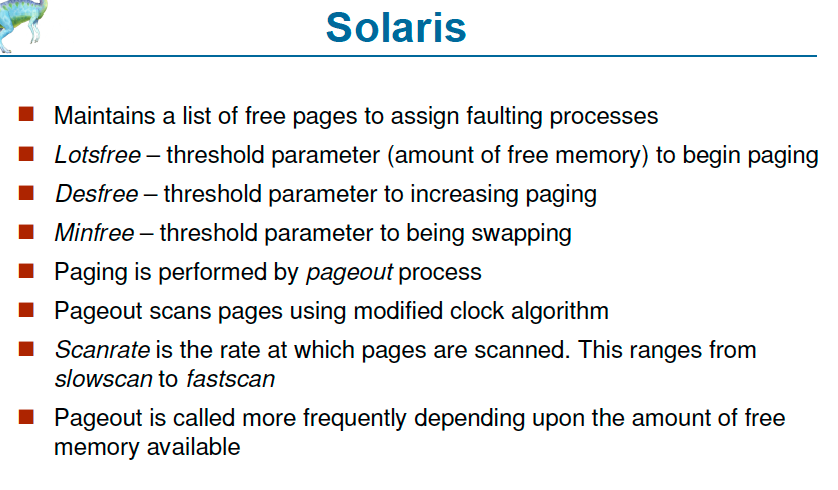

# 9.Virtual Memory

separation between phyical memory and logical memory 

Application only needs to access Virtual memory \(Demand paging, Demand Segmentation\)

Demand Paging - Bring a page into memory only when it's needed

